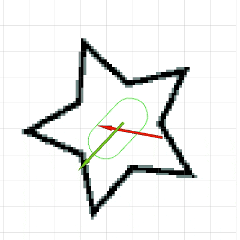
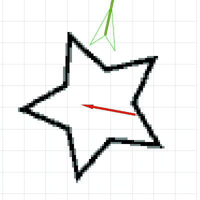
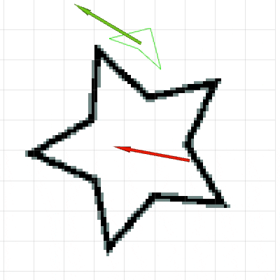

# DposeGoalTolerance

The library allows you to extend your nav_core::GlobalPlanner with a goal tolerance feature.
It implements the gpp_interface::PrePlanningInterface.
In order to use it, you will need the [gpp_plugin::GppPlugin](https://github.com/dorezyuk/gpp.git).
<p float="left" align="center">
    
    
    
</p>
The library works with arbitrary footprints as showcased above.
The gifs show the original global pose as red arrows.
The displaced pose is shown as a green arrow.
The underlying displaced footprint is depicted as a green polygon.
The left gif show-cases the pose-displacement for a pill-shaped robot.
The right gif shows the functionality for a banana-shaped robot.

## Implementation

The library is build on top of [DposeCore](../dpose_core).
DposeCore outputs the collision costs, Jacobian of that cost and Hessian of the cost for a given polygonal footprint.
With this values the formulation of the optimization problem is straight forward:
```
min(f(x,y,theta))
s.t. norm([x, y]^T - [x_goal, y_goal]^T) < lin_tolerance
     norm(theta - theta_goal)            < rot_tolerance
```
The function `f` represents our cost function.
It's dependent on the planar pose of the robot given by x, y and theta.
We seek to minimize it under the constraints that the euclidean and angular distances to the goal are smaller than lin_tolerance and rot_tolerance.
The library [Ipopt](https://coin-or.github.io/Ipopt) can handle optimizations under constraints and is used to solve the problem.

This library defines additionally to the cost-function implemented in DposeCore two optional cost functions.
They can be controlled by the weights `weight_<start|goal>_<lin|rot>` (see below).
The weights `weight_goal_<lin|rot>` are used in a cost function which penalizes the distance to the original **goal**.
Increasing those weights will force the optimizer to prefer solutions closer to the goal pose.
The weights `weight_start_<lin|rot>` are used in the cost function which penalizes the distance to the **current pose** of the robot.
Increasing those weights results in a "greedy" heuristic, forcing the optimizer to move the solution towards the robot.

## Build and Install

If you want to install this package from sources clone this repository into your workspace and build its

```
cd catkin_ws/src
git clone https://github.com/dorezyuk/dpose.git
catkin build dpose_goal_tolerance
```

## API

The subsequent topics and  parameters are defined within the namespace `~/name`, where `name` is the name under which this plugin is loaded.

### Publications

#### ~\<name>/filtered ([geometry_msgs::PoseStamped](http://docs.ros.org/en/noetic/api/geometry_msgs/html/msg/PoseStamped.html))

Debug topic which will publish the displaced goal pose.

### Parameters

#### tol (Float, 5)

Termination criteria for Ipopt. See [tol](https://coin-or.github.io/Ipopt/OPTIONS.html#OPT_Termination) parameter for details.

#### max_iter (Int, 20)

Termination criteria for Ipopt based on the number of iterations. See [max_iter](https://coin-or.github.io/Ipopt/OPTIONS.html#OPT_Termination) parameter for details.

#### max_cpu_time (Float, 0.5)

Termination criteria for Ipopt based on the cpu time (in seconds). See [max_iter](https://coin-or.github.io/Ipopt/OPTIONS.html#OPT_Termination) parameter for details.

#### mu_strategy (String, adaptive)

Strategy for the barrier parameter update used within Ipopt. Possible values are
`adaptive` and `monotone`. See [mu_strategy](https://coin-or.github.io/Ipopt/OPTIONS.html#OPT_Barrier_Parameter) parameter for details.

#### lin_tolerance (Float, 1)

Translational goal tolerance in meters. Acceptable values are within the range [0, 2].

#### rot_tolerance (Float, 1)

Angular  goal tolerance in rads. Acceptable values are within the range [0, pi].

#### weight_goal_lin (Float, 1)

Weight penalizing translational distance from the goal.
Acceptable values are within the range [0, 1000].

#### weight_goal_rot (Float, 1)

Weight penalizing angular deviations from the goal.
Acceptable values are within the range [0, 1000].

#### weight_start_lin (Float, 1)

Weight penalizing angular deviations from the start.
Acceptable values are within the range [0, 1000].

#### weight_start_rot (Float, 1)

Weight penalizing angular deviations from the start.
Acceptable values are within the range [0, 1000].
